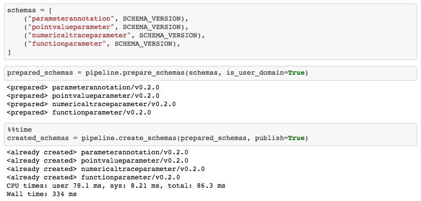
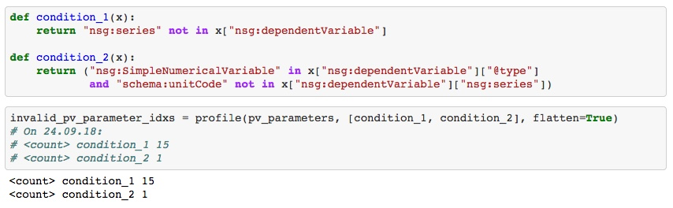
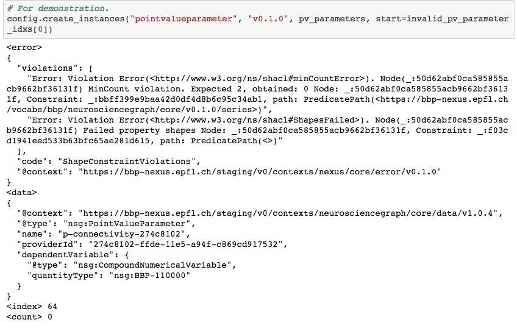
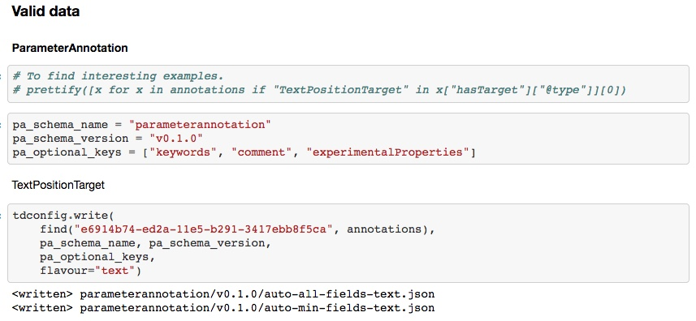
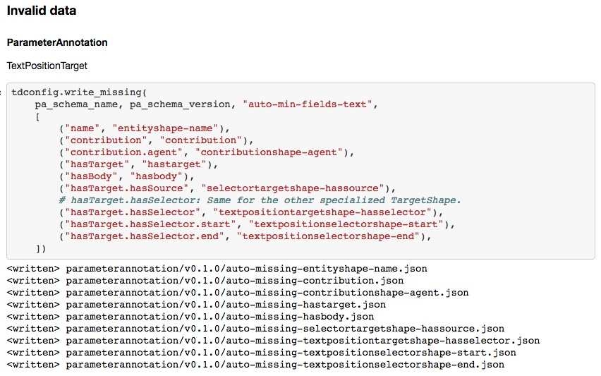

## Goal

If you have to **model your domain** and to **transform your data into JSON-LD**
for Nexus, you might have asked yourself:

- What **workflow** should I follow?
- How can I build a **configurable Data Pipeline** to support my work?
- From what template to start to build **maintenable Data Engineering** logic?
- How can I **assess the Data Quality** of my source data?

Files in this folder (`kg`) have been created to support the work on modeling
the literature annotation domain and transforming the modeling parameters
annotated with NeuroCurator for integration into the Blue Brain Knowledge Graph.

They have also been designed as a **recommendation on how to harmonize user
workflows** and personal toolkits. There is a lot of space for improvement but
this sets **solid foundations for the future** and provides a lot of **common
operations done in a canonical way**.

---

Some **neat features** are:

**Pipeline**

* Configure different pipelines (user domain, Neuroshapes, ...).

```
config = PipelineConfiguration(TOKEN, DEPLOYMENT, client, organization, domain, organization_desc, domain_desc)
```

**Schemas**

* Load schemas from disk.
* Prepare schemas from Neuroschapes.
* Push prepared schemas in a **defined order**.



**Data Quality**

* Define quality rules (invalid data).
* Get the **proportion of data** which are not following them, for each of them.
* Get ‘cursors’ to temporarily exclude invalid data during further processing.



**Error handling**

* Get a readable validation error message when pushing instances.
* Get the invalid instance metadata without having to look for it.
* Get the number of successfully pushed instances before the error.
* Get a ‘cursor’ on the instance which has raised the error.
* Be able to **restart pushing instances where it stopped**.
* Be able to **prevent known invalid instances being pushed**.



**Test data for Neuroshapes**

* Update automatically test data to **follow changes in the SHACL shapes or in
the transformation logic**.


* Write valid test data for Neuroshapes (`min-fields.json` & `all-fields.json`).
* Handle 'flavours' of data (i.e. same root shape with **different nested field shapes**).



* Write invalid test data for Neuroshapes from valid data (`missing-xyz.json`).
* Handle **nested field deletion**.



And more!!!
