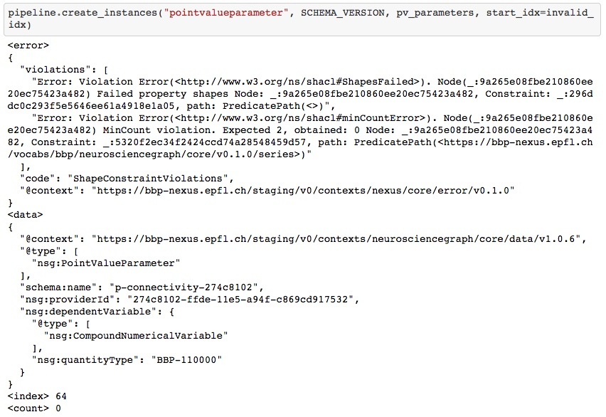
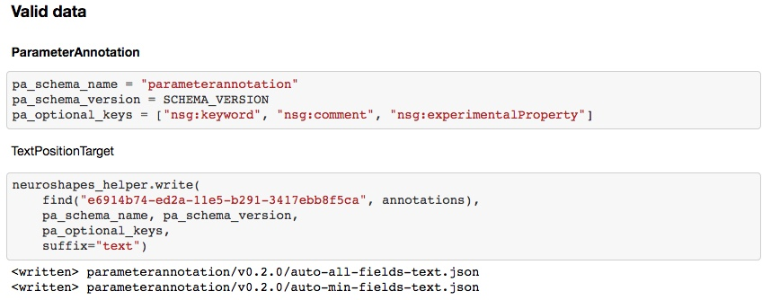
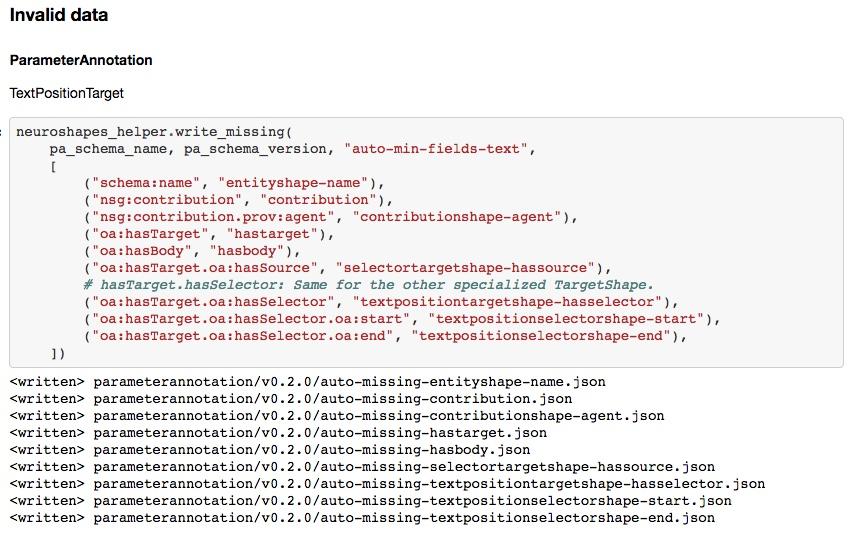

## Goal

If you have to **model your domain** and to **transform your data into JSON-LD**
for [Blue Brain Nexus](https://bluebrain.github.io/nexus/), you might have asked
yourself:

- What **workflow** should I follow?
- How can I build a **configurable Data Pipeline** to support my work?
- From what template to start to build **maintainable Data Engineering** logic?
- How can I **assess the Data Quality** of my source data?

Files in this folder (`kg`) have been created to support the work on modeling
the literature annotation domain and transforming the modeling parameters
annotated with NeuroCurator for integration into the **Blue Brain Knowledge Graph**.

They have also been designed as a recommendation on how to **harmonize user
workflows and personal toolkits**. There is a lot of space for improvement but
this sets **solid foundations** for the future and provides a lot of **common
operations done in a canonical way**.

Components:
- Workflow: `Literature Annotation - Knowledge Graph.ipynb`
- Data Pipeline: `nexus_utils.py`
- Data Engineering: `annotations.py`, `parameters.py`, `CONVENTIONS.md`
- Data Quality: `kg_utils.py`

Designed for:
- Nexus v0
- pyxus 0.5.1
- Python 3.7+


## Future

* Multithreaded create_xyz() methods.
* Workflow orchestration with a language like CWL (Common Workflow Language).


## Features

Overview.

For the toolkit methods and functions, please refer to the [KG Utils](#kg-utils)
and [Nexus Utils](#nexus-utils) sections or directly to the code.

### Pipeline

* Configure different pipelines (user domain, Neuroshapes, ...).

```
pipeline = PipelineConfiguration(neuroshapes_dir, client, organization, domain, organization_desc, domain_desc)
```

### Schemas

* Load schemas from disk.
* Prepare schemas from Neuroshapes.
* Push prepared schemas in a **defined order**.


### Data Quality

* Define quality rules (invalid data).
* Get the **proportion of data** which are not following them, for each of them.
* Get ‘cursors’ to temporarily exclude invalid data during further processing.


### Error handling

* Get a readable validation error message when pushing instances.
* Get the invalid instance metadata without having to look for it.
* Get the number of successfully pushed instances before the error.
* Get a ‘cursor’ on the instance which has raised the error.
* Be able to **restart pushing instances where it stopped**.
* Be able to **prevent known invalid instances being pushed**.



### Test data for Neuroshapes

* Update automatically test data to **follow changes in the SHACL shapes or in
the transformation logic**.
* Write valid test data for Neuroshapes (`min-fields.json` & `all-fields.json`).
* Handle 'flavours' of data (i.e. same root shape with **different nested field shapes**).



* Write invalid test data for Neuroshapes from valid data (`missing-xyz.json`).
* Handle **nested field deletion**.



### KG Utils

```
class TestDataConfiguration:
    
    def write(self, data, schema_name, schema_version, optional_properties, suffix=None) -> None
    def write_missing(self, schema_name, schema_version, base_filename, config) -> None


select_by_type(_type, data) -> Iterator[JSON]
find(uuid, data, uuid_field="nsg:providerId") -> Optional[JSON]
profile(data, conditions, flatten=False) -> Union[List[List[int]], List[int]]
prepare(data, replacements) -> str
remove_empty_values(data) -> None
```

### Nexus Utils

```
class PipelineConfiguration:
    
    # Checking helpers.
    
    def is_organization_created(self) -> bool
    def is_domain_created(self) -> bool
    def is_context_created(self, name, version) -> bool
    def is_schema_created(self, name, version) -> bool
    def are_contexts_created(self, names_versions) -> Dict[str, bool]
    def are_schemas_created(self, names_versions) -> Dict[str, bool]
    
    # Preparation helpers.
    
    def prepare_context(self, name, version) -> JSON
    def prepare_schema(self, name, version, is_user_domain=False) -> JSON
    def prepare_contexts(self, names_versions) -> Dict[str, JSON]
    def prepare_schemas(self, names_versions, is_user_domain=False) -> Dict[str, JSON]
    
    # Creation helpers.
    
    def create_organization(self) -> Organization
    def create_domain(self) -> Domain
    def create_context(self, name, version, data, publish) -> Context
    def create_schema(self, name, version, data, publish) -> Schema
    def create_contexts(self, data, publish) -> Dict[str, Context]
    def create_schemas(self, data, publish) -> Dict[str, Schema]
    def create_instance(self, schema_name, schema_version, data) -> Optional[Instance]
    def create_instances(self, schema_name, schema_version, data, start_idx=0, exclude_idxs=None) -> None
    
    # Listing helpers.
    
    def instances_by_schema(self, name, version, resolve=False) -> SearchResultList
    def instances_of_domain(self, resolve=False) -> SearchResultList
    def retrieve_all_results(self, x) -> Optional[List[Union[SearchResult, Instance]]]
    
    # Cleaning helpers.
    
    def clean(self, organization, domain) -> None


class SearchConfiguration:

    # Searching helpers.

    def search(self, query, limit=10) -> List[JSON]
    def search_by_path(self, path, value, limit=10) -> List[JSON]
    def search_by_paths(self, paths_values, limit=10) -> List[JSON]


def prettify(data) -> None
def init_client(token, deployment) -> NexusClient
def uuid_iri_mapping(instances) -> Iterator[Tuple[str, str]]

```
